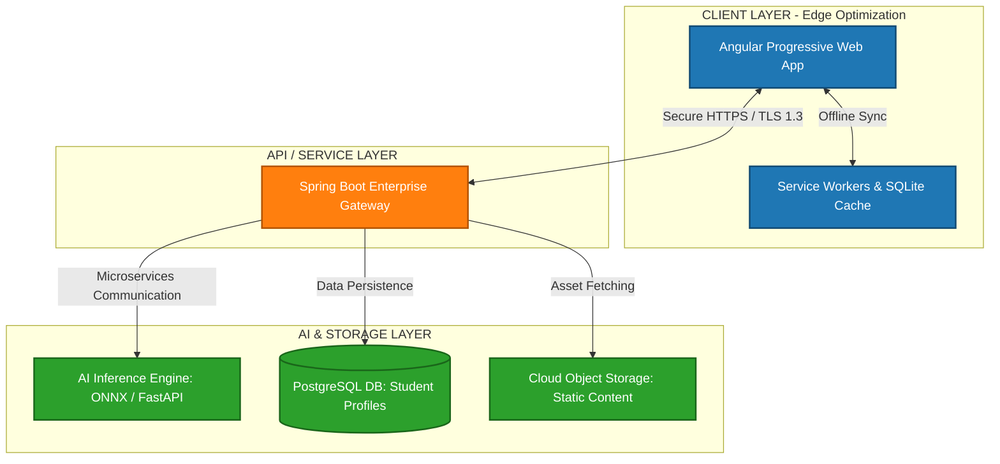

# AI-Powered, Low-Bandwidth STEM Adaptive Learning Platform

## Project Overview
This repository contains the architecture, data models, and system configurations for an offline-first, AI-driven educational platform designed for resource-constrained school districts.

## System Architecture

## Deep-Dive Component Specifications

### A. Client Layer (Front-End & Offline Optimization)
* **Core Stack:** Angular (TypeScript), HTML5, Tailwind CSS.
* **Offline-First Paradigm:** Implemented using Progressive Web App (PWA) specifications. Service workers cache core STEM modules.
* **Edge Storage:** Utilizes IndexedDB and SQLite. Student response metrics are written locally when offline and queue-synced back via delta-compression protocols once connected.

### B. API Gateway & Business Logic (Backend)
* **Core Stack:** Java, Spring Boot, Spring Security.
* **Performance:** Built around asynchronous reactive microservices to maintain low memory overhead.
* **Security:** Stateless authentication secured via JSON Web Tokens (JWT). Implements explicit Role-Based Access Controls (RBAC).

### C. AI & Adaptivity Core (Machine Learning Architecture)
* **Data Models:** Python, FastAPI, PyTorch, and Hugging Face Transformers.
* **Natural Language Processing (NLP):** Employs distilled transformer models (e.g., DistilBERT) to handle semantics parsing and grading.
* **Computer Vision (CV):** Uses optimized MobileNet architectures to read and process handwritten equations via mobile device cameras.
* **Knowledge-Tracing Engine:** Built upon Bayesian Knowledge Tracing (BKT). The algorithm dynamically recalibrates the student’s mastery level to tailor subsequent modular assignments.

## Data Privacy & Strict Regulatory Compliance
* **COPPA Compliance:** The platform strictly restricts the collection of personal identifying information (PII) for users under 13.
* **FERPA Compliance:** Educational records are isolated via row-level security within the PostgreSQL relational database. Data encryption protocols utilize AES-256-GCM for data-at-rest and TLS 1.3 for data-in-transit.
