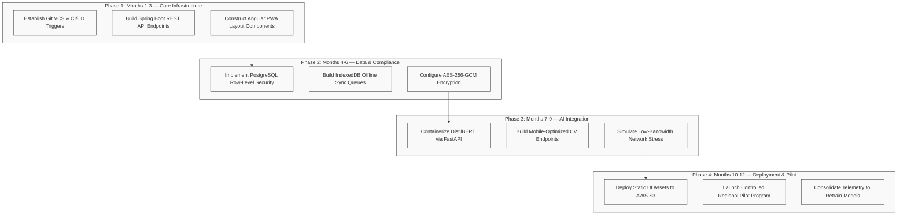

Spring Boot microservices gateway

```mermaid
graph TD
    classDef phase fill:#f9f9f9,stroke:#333,stroke-width:1px;
    classDef task fill:#fff,stroke:#666,stroke-width:1px,font-size:12px;

    subgraph P1 [Phase 1: Months 1-3 — Core Infrastructure]
        A[Establish Git VCS & CI/CD Triggers]
        B[Build Spring Boot REST API Endpoints]
        C[Construct Angular PWA Layout Components]
    end
    class P1,A,B,C phase;

    subgraph P2 [Phase 2: Months 4-6 — Data & Compliance]
        D[Implement PostgreSQL Row-Level Security]
        E[Build IndexedDB Offline Sync Queues]
        F[Configure AES-256-GCM Encryption]
    end
    class P2,D,E,F phase;

    subgraph P3 [Phase 3: Months 7-9 — AI Integration]
        G[Containerize DistilBERT via FastAPI]
        H[Build Mobile-Optimized CV Endpoints]
        I[Simulate Low-Bandwidth Network Stress]
    end
    class P3,G,H,I phase;

    subgraph P4 [Phase 4: Months 10-12 — Deployment & Pilot]
        J[Deploy Static UI Assets to AWS S3]
        K[Launch Controlled Regional Pilot Program]
        L[Consolidate Telemetry to Retrain Models]
    end
    class P4,J,K,L phase;

    %% Workflow Flow
    C --> D
    F --> G
    I --> J
```
